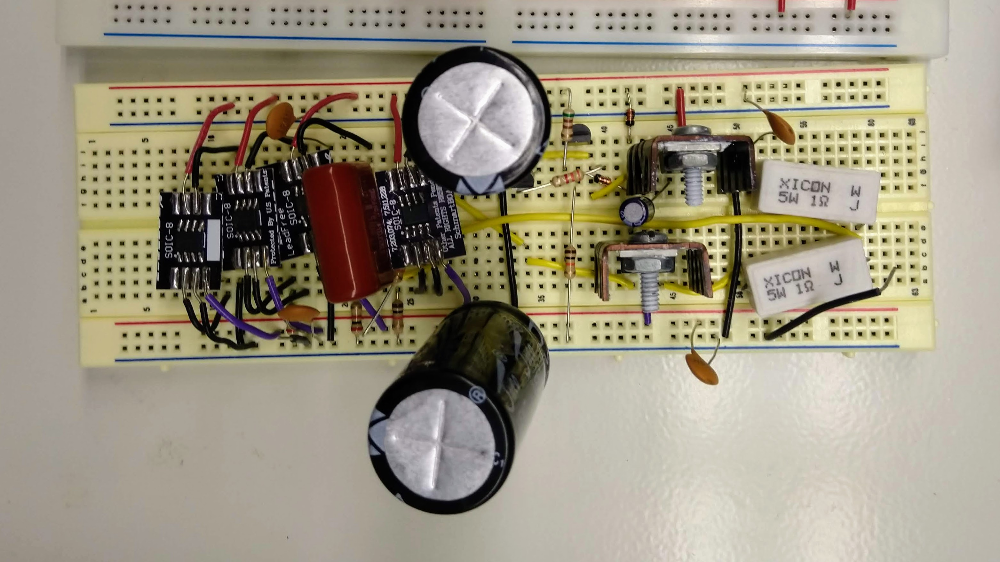

# Analog Electronics Projects

# Table of Contents

1.  [Overview](#org3ce4148)
2.  [Audio Amplification](#org06c47f4)
    1.  [Project Goals](#orge2a00b3)
    2.  [Design](#org6cd3fbe)
    3.  [Implementation](#orgd13240f)
3.  [Signal Modulation](#orge65c2a2)
    1.  [Project Goals](#org3a9305b)
    2.  [Design](#org6eae91a)
    3.  [Implementation](#orgcb7eb12)

# Overview

This repository contains some of the work I did in my first electrical
engineering class. Our main project for the semester was the design of
a high fidelity audio amplifier. We designed and built circuits in
sections, mainly the preamplifer and the power amplifier. My final
design used several novel parts and techniques, and led me to an
extremely high fidelity amplifier for a 90 watt speaker.

In the remainder of the semester, we aimed to construct a system that
transmitted audio by using it to modulate a carrier wave, as in
radio. The original audio would then be extracted via demodulation. I
attempted an ambitious frequency modulation design using operational
amplifiers. I did not finish my system, but my schematic for the Wein
bridge oscillator I used to modulate signals is included.

# Audio Amplification

The `amplifier` directory contains the final schematic for my audio
amplifier and three images of the circuit assembled on a
breadboard. In `amplifier/sim` are the LTspice files I used to
simulate the amplifier's behavior. In `amplifier/amp_v1` are my
schematic and engineering notes for the first version of my amplifier.

## Project Goals

-   Learn how operational amplifiers work, what they are used for, and
    their characteristics
-   Understand power amplification, especially transistor push-pull
    pairs and crossover distortion
-   Implement a dual power supply circuit and minimize supply voltage
    ripple using capacitors
-   Make informed decisions about components to use by reading and
    grasping information in data sheets
-   Draw circuit diagrams using pencil and paper to work out and
    visualize how the system works
-   Simulate circuits using SPICE to understand their characteristics
    before building them
-   Use oscilloscopes and other lab equipment to probe circuits and see
    the effects of each stage
-   Design and build an audio amplifier out of only linear components,
    discrete transistors and diodes, and operational amplifiers
-   Take input from a microphone or a computer's audio output, and drive
    a speaker with 8 ohm impedance
-   Achieve high fidelity audio amplification: the input and output
    waveforms should match in shape, with minimal distortion

## Design

This amplifier requires a steady supply of +/- 30 volts at up to 3 amps. It
is composed of a three-stage preamplifer with gain about 810, a unity
gain buffer, and a class AB power amplifier with base current provided
by a constant current source. It can drive a speaker rated at 90 watts
or greater when run at full voltage.

The power supply was provided by two off the shelf bench power
supplies. I prevented voltage ripple with a pair of large electrolytic
capacitors to compensate for high intermittent current draw by the
power amplifier. Since these capacitors have appreciable series
resistance, I supplemented them with two sets of small ceramic disc
capacitors to aid in response time and prevent unintentional
oscillations.

Input to the amplifier may be from a microphone (dynamic or properly
wired condenser), put I primarily fed in output from computer audio
jacks. The first amplification stage is an inverting summing
amplifier. Connecting the noninverting input to ground creates a
virtual ground at the inverting input, allowing both inputs to be
summed without ill effects. Thus stereo channels may be combined into
one audio signal for amplification.

This first stage has a gain of 10, and the two following stages are
noninverting amplifiers with gain of 9 each. Overall, input voltage is
amplified 810 times. I chose the ADA4700 operational amplifier for its
large voltage supply range, high input impedance, and extremely fast
slew rate. It could handle larger gains per stage, but not so large
that I would have been able to reduce the number of stages in the
preamplifier.

After the preamplifier is a high pass filter to eliminate voltage
offset. The passband is set to start around 20 Hz, so all valuable
audio frequencies will be passed. It is followed by a unity follower
amp to isolate the preamplifier from the power amplifier. This is a
noninverting configuration with feedback taken from the power
amplifier output, to encourage faithful reproduction of the signal at
the output.

The power amplifier is a unique design inspired by several examples
found in The Art of Electronics (Horowitz and Hill). I chose the
TIP102 and TIP106 for their extremely high current gain, and because
Darlington transistors proved to be difficult to work with. The novel
aspect of this amplifier is the method by which the transistors are
biased and supplied with base current. A classic way of doing this is
with diodes from input to bases, and resistors from bases to supplies.

Without biasing to hold them in conduction at quiescence, the power
transistors do not conduct when the signal is around ground, creating
annoying crossover distortion. I bias the power transistors using a
simple transistor circuit to provide a customizable number of diode
drops. Around three diode drops (~1.8 volts) between bases gave the
best results. I tied the bases together with a small electrolytic
capacitor to ensure that the waveforms would be closely matched,
except for this offset.

The unity follower amplifier cannot provide adequate current to the
transistor bases for current to flow from collector to emitter. I
chose to use a constant current source to provide enough base current
to sustain the maximum output current of three amperes. This is
superior to simple resistors connecting bases to rails because
available current varies significantly with that solution, while a
current source keeps it constant.

At the output of the amplifier, there is a 1 ohm power resistor
between each emitter and the load. These emitter resistors slightly
decrease the current gain, but play an important role by stabilizing
the transistors' behavior in the face of temperature variations. Each
power transistor must have a heat sink, but they would still be
susceptible to thermal runaway without resistors limiting overly high
current draw.

The output stage connects to a load of 8 ohms, which may be a power
resistor, for testing, or a speaker. This amplifier should not be
connected to a speaker rated to dissipate less than 90 watts, as this
could lead to destruction of the speaker or unknown effects on the
amplifier circuit. Real speakers have complex impedance including
resistive, capacitive, and inductive elements, but this does not
significantly impact the performance of the amplifier in operation.

## Implementation

This project developed in several stages. First I constructed simple
voltage divider circuits, then noninverting and inverting amplifiers,
then filters, then various transistor amplifier designs. I made
sketches and schematics with pencil and paper for each stage,
calculating component values myself. When it came time to build the
first version, it was simple to combine all of these pieces into a
single audio chain.

Another important aspect of my process was simulating all of my
designs. We used the LTspice schematic capture and simulation tool to
validate designs before actually getting components, cutting wires,
and assembling circuits. For all of the individual circuits and
amplifiers I built, I brought my pencil schematics into the
software. I simulated circuit behavior at quiescence and at many input
conditions to refine my designs.

My most significant challenges in the first version were selecting the
resistors for the transistor biasing scheme, and keeping the
temperature of the circuit under control. During one test, my
transistors heated to 500 degrees Fahrenheit as measured by an
infrared thermometer, causing a permanent color change of the heat
sink paint from black to dull, shiny red.

The engineering notes from my first version detail my solutions to the
problems I encountered there. I felt, though, that there was much to
be improved. My first amplifier could only be run at +/- 15 volts and
still left the output audio slightly too distorted for my taste. Since
I had time remaining, I decided to design and construct a new audio
amplifier chain to address these issues and pursue interesting new
circuit designs.

This new design, detailed in the section above, was slightly more
complex but performed significantly better, able to drive a loud
speaker with inaudible distortion. The benefits I saw, however, were
not attributable to the design alone. I also improved the circuit
topology to reduce undesirable characteristics such as poor grounding
and excessive impedance due to connections and wire length.

I shortened connections by placing operational amplifiers closer
together and carefully trimming wires to be no longer than
necessary. I positioned the power supply capacitors right next to the
output stage for the fastest response to high current draw. I placed
the ceramic disc capacitors in strategic locations as well. I used
thick wires for the long power supply connections and brought them in
right next to the output stage, the largest power draw.

All my experiences working on this project were valuable. I learned an
immense amount about the techniques and pitfalls of analog circuit
design, and had the opportunity to create my own design and set my own
targets. I gained experience with circuit design, simulation, and
testing. The most important lesson I took is that sketches and
schematics on pencil and paper are the best tool for understanding a
problem and discerning solutions.

# Signal Modulation

The `oscillator` directory includes a schematic of my most recent
design for this project. In `oscillator/sim` are the LTspice files I
used to simulate its behavior.

## Project Goals

-   Learn about signal modulation and how it can be used to transmit
    multiple independent signals through the same medium
-   Understand the means by which different modulation schemes are
    implemented, and the role of operational amplifiers
-   Design and build a modulator for signals in the audio frequency
    range
-   Determine how to demodulate a modulated signal, and design a circuit
    to do so
-   Demonstrate modulating, demodulating, and playing audio, all in the
    same chain
-   Continue to use valuable design, simulation, and testing techniques
    such as drawing schematics

## Design

The Wein bridge is a bridge circuit that may be combined with an
operational amplifier to serve as an oscillator. A Wein bridge
oscillator produces a sine wave of a particular frequency. It behaves
like a bandpass filter followed by an amplifier with automatic gain
control, so that one frequency is isolated from random noise and then
amplified to a particular level for use later.

My design is different from a regular Wein bridge oscillator because
my goal was to construct a frequency modulation circuit. In this
modulation scheme, the frequency of a carrier wave is slightly varied
according to the voltage of an input signal. To achieve this effect, a
voltage controlled oscillator is necessary. This presents a challenge
over that of a regular oscillator, as some component of the circuit
must, in effect, change in value based on a voltage.

Junction field effect transistors (JFET) may be easily wired to act as
highly linear voltage controlled resistors. The Wein bridge circuit
requires two equal resistors, so I was able to obtain a matched pair
of JFETs. I placed these transistors into the Wein bridge as
resistors, along with a pair of capacitors. Nominally, the resistance
is set by setting the voltage on a node connecting a pair of resistors
which are themselves tied to the transistor gates.

The Wein bridge sets the frequency and sustains the oscillation, but
in order to ensure stability and constant amplitude, gain control is
necessary. My design uses a network of components connected to both
the output and the inverting input of the operational amplifier. A
JFET is biased with a potentiometer, diode, and voltage divider to act
as a resistor that varies in value with the oscillator output. This
circuit may be tuned with the pot, and keeps amplitude in check.

## Implementation

I chose to make this voltage controlled oscillator the focus of my
modulation work. I tried a number of other oscillator designs before
settling on this one, which I designed in LTspice and simulated, with
limited success. It is difficult to find good models for many
components, and finding the right simulation settings for oscillations
can be a challenge. The circuit did oscillate at a set frequency in
simulation, though, so I moved on to building.

Unfortunately I have no pictures, but I constructed this circuit on a
breadboard and tested with the voltage controlled resistors at a set
level. The circuit started up and oscillated steadily, but some tuning
of the potentiometer was required to obtain output close to a pure
sine wave. Unfortunately, I encountered issues while testing with a
variable voltage. The oscillation frequency hardly changed and the
gate voltage seemed little affected by the input.

As the end of the semester approached, I ran out of time to continue
working on this design. Were I to return to it, I would add an
additional node connecting the bridge circuit to the gain control
circuit, as in some other Wein bridge oscillator designs. I would also
work on a better method for setting the voltage controlled resistors;
in particular I think a much stiffer voltage source, possibly capable
of higher current, would be helpful.

